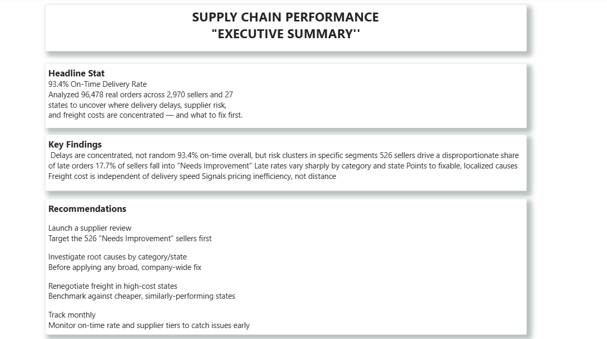
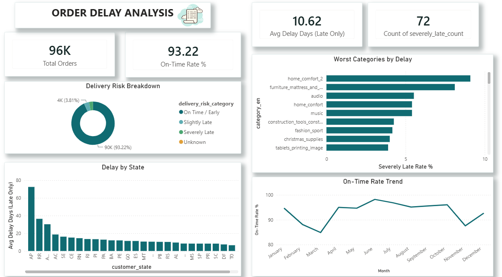
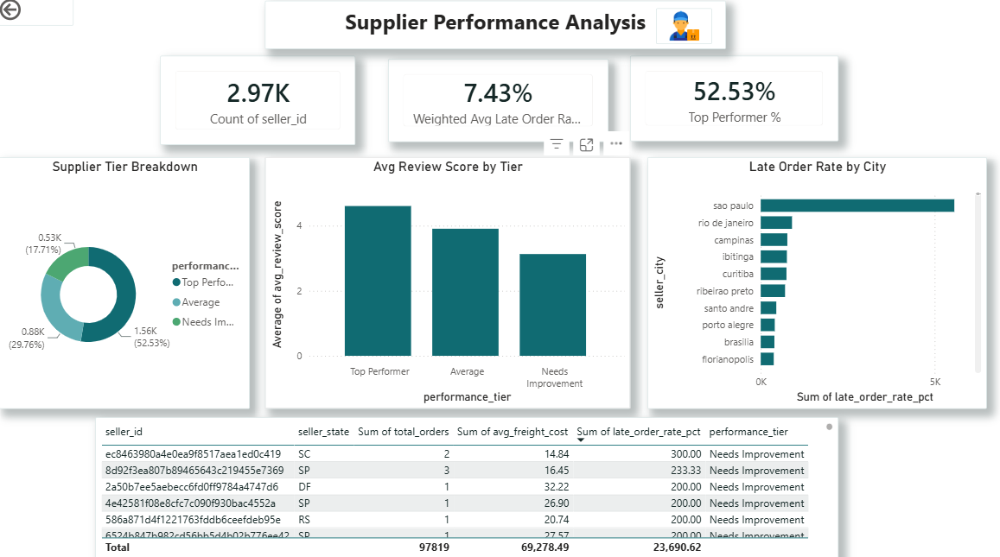
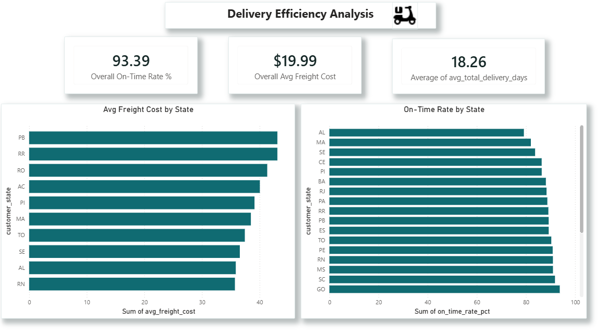

# Supply_chain_analytics_dashboard
# Supply Chain Performance Analysis — Olist E-Commerce

A Python + SQL + Power BI project analyzing 96,478 real e-commerce orders to uncover delivery delay patterns, supplier performance gaps, and logistics cost inefficiencies — built to identify *where* the supply chain is breaking down and *what* to fix first.

---

## Overview

This project takes Olist's raw, real-world Brazilian e-commerce dataset — 9 separate tables, over 1.5 million combined rows — and turns it into a decision-ready analytics system. The raw data was cleaned and engineered using Python (pandas & numpy), loaded into a SQLite database and queried with 20 SQL scripts covering delivery performance, supplier risk, and logistics cost, then connected to Power BI to build a 4-page interactive dashboard with custom DAX measures and an executive summary page with data-driven recommendations.

---

## STAR

**Situation:** The business has no structured way to see where deliveries are failing, which suppliers are driving late orders, or where logistics costs are inflated — issues are only visible after customers complain.

**Task:** Build an end-to-end analytics pipeline — from raw, messy order data to a decision-ready dashboard — that quantifies delivery performance, flags underperforming suppliers, and surfaces regional cost inefficiencies.

**Action:** Cleaned and engineered a 110,197-row analysis-ready fact table in Python using pandas and numpy (date parsing, deduplication, geolocation outlier removal, `np.select`-based risk classification, IQR-based outlier detection). Loaded the cleaned data into SQLite and wrote 20 SQL queries using joins, subqueries, `CASE` statements, and window functions (`RANK`, `PERCENT_RANK`, `LAG`, `NTILE`, `CUME_DIST`). Connected the results to Power BI and built a 4-page report using DAX measures (`CALCULATE`, `DIVIDE`, `SUMX`, `RANKX`, time intelligence) for weighted KPIs, delivery risk scoring, and supplier tiering.

**Result:** Found that 93.4% of orders arrive on time overall, but delay is concentrated — not random — with 526 sellers (17.7% of the seller base) driving a disproportionate share of late orders, specific product categories showing severely-late rates over 3x the network average, and freight cost varying significantly by state independent of delivery speed.

---

## Dataset

**Source:** [Olist Brazilian E-Commerce Public Dataset](https://www.kaggle.com/datasets/olistbr/brazilian-ecommerce) — real, anonymized order data released publicly by Olist, a real Brazilian e-commerce marketplace integrator.

- 9 relational tables — orders, order items, payments, reviews, customers, products, sellers, geolocation, category translation
- 99,441 orders, 110,197+ order line items after cleaning
- Covers real order timestamps, delivery performance, payments, freight cost, customer reviews, and seller/customer geolocation across 27 Brazilian states

---

## Business Problems and Solutions

**1. Which orders took longer than 30 days to deliver?**

```sql
SELECT order_id, customer_city, customer_state, delivery_days
FROM fact_orders
WHERE delivery_days > 30;
```

**2. What is the average delivery time by state?**

```sql
SELECT customer_state,
       COUNT(*) AS total_orders,
       ROUND(AVG(delivery_days), 1) AS avg_delivery_days
FROM fact_orders
GROUP BY customer_state
ORDER BY avg_delivery_days DESC;
```

**3. Which product categories have the most severely late orders?**

```sql
SELECT category_en, COUNT(*) AS late_order_count
FROM fact_orders
WHERE delivery_risk_category = 'Severely Late'
GROUP BY category_en
ORDER BY late_order_count DESC;
```

**4. What is total revenue and order count by payment type?**

```sql
SELECT payment_types_used, COUNT(*) AS order_count,
       ROUND(SUM(total_payment_value), 2) AS total_revenue
FROM fact_orders
GROUP BY payment_types_used
ORDER BY total_revenue DESC;
```

**5. Which orders have missing or zero freight value?**

```sql
SELECT order_id, seller_id, freight_value
FROM fact_orders
WHERE freight_value IS NULL OR freight_value = 0;
```

**6. What is the delivery risk breakdown by state?**

```sql
SELECT customer_state,
       SUM(CASE WHEN delivery_risk_category = 'On Time / Early' THEN 1 ELSE 0 END) AS on_time,
       SUM(CASE WHEN delivery_risk_category = 'Slightly Late' THEN 1 ELSE 0 END) AS slightly_late,
       SUM(CASE WHEN delivery_risk_category = 'Severely Late' THEN 1 ELSE 0 END) AS severely_late
FROM fact_orders
GROUP BY customer_state
ORDER BY severely_late DESC;
```

**7. Which categories have an above-average order value?**

```sql
SELECT category_en, ROUND(AVG(total_payment_value), 2) AS avg_order_value
FROM fact_orders
GROUP BY category_en
HAVING AVG(total_payment_value) > (
    SELECT AVG(total_payment_value) FROM fact_orders
)
ORDER BY avg_order_value DESC;
```

**8. Which sellers have an above-average freight cost?**

```sql
SELECT seller_id, ROUND(AVG(freight_value), 2) AS avg_freight
FROM fact_orders
GROUP BY seller_id
HAVING AVG(freight_value) > (
    SELECT AVG(freight_value) FROM fact_orders
)
ORDER BY avg_freight DESC;
```

**9. Which sellers have at least one severely late delivery?**

```sql
SELECT DISTINCT f.seller_id
FROM fact_orders f
WHERE EXISTS (
    SELECT 1 FROM fact_orders f2
    WHERE f2.seller_id = f.seller_id
    AND f2.delivery_risk_category = 'Severely Late'
);
```

**10. What share of total orders does each state represent?**

```sql
SELECT customer_state,
       COUNT(*) AS total_orders,
       ROUND(100.0 * COUNT(*) / (SELECT COUNT(*) FROM fact_orders), 2) AS pct_of_all_orders
FROM fact_orders
GROUP BY customer_state
ORDER BY pct_of_all_orders DESC;
```

**11. How does each order rank by value within its product category?**

```sql
SELECT category_en, customer_state, total_payment_value,
       RANK() OVER (PARTITION BY category_en ORDER BY total_payment_value DESC) AS rank_in_category
FROM fact_orders
WHERE category_en != 'unknown';
```

**12. What is the running total of revenue by state?**

```sql
SELECT customer_state,
       SUM(total_payment_value) AS state_revenue,
       SUM(SUM(total_payment_value)) OVER (ORDER BY SUM(total_payment_value) DESC) AS running_total_revenue
FROM fact_orders
GROUP BY customer_state
ORDER BY state_revenue DESC;
```

**13. What is the 7-order rolling average of delivery days?**

```sql
SELECT order_id, delivery_days,
       AVG(delivery_days) OVER (
           ORDER BY order_id
           ROWS BETWEEN 6 PRECEDING AND CURRENT ROW
       ) AS rolling_avg_7
FROM fact_orders
WHERE delivery_days IS NOT NULL;
```

**14. What is the percentile rank of every order by value?**

```sql
SELECT order_id, customer_state, total_payment_value,
       ROUND(PERCENT_RANK() OVER (ORDER BY total_payment_value), 4) AS percentile_rank
FROM fact_orders
WHERE total_payment_value IS NOT NULL;
```

**15. How does each state's revenue compare to the cross-state average?**

```sql
WITH state_totals AS (
    SELECT customer_state, SUM(total_payment_value) AS revenue
    FROM fact_orders
    GROUP BY customer_state
),
state_avg AS (
    SELECT AVG(revenue) AS avg_state_revenue FROM state_totals
)
SELECT st.customer_state, st.revenue,
       ROUND(st.revenue - sa.avg_state_revenue, 2) AS diff_from_avg
FROM state_totals st, state_avg sa
ORDER BY diff_from_avg DESC;
```

**16. Which sellers are located where, and what are they shipping?**

```sql
SELECT f.order_id, f.category_en, s.seller_city, s.seller_state
FROM fact_orders f
JOIN sellers s ON f.seller_id = s.seller_id;
```

**17. What are total orders and revenue by seller state?**

```sql
SELECT s.seller_state, COUNT(f.order_id) AS total_orders,
       ROUND(SUM(f.total_payment_value), 2) AS total_revenue
FROM fact_orders f
JOIN sellers s ON f.seller_id = s.seller_id
GROUP BY s.seller_state
ORDER BY total_revenue DESC;
```

**18. Which orders ship to a different city than the seller's own city?**

```sql
SELECT f.order_id, f.customer_city, s.seller_city
FROM fact_orders f
JOIN sellers s ON f.seller_id = s.seller_id
WHERE f.customer_city != s.seller_city;
```

**19. What is the average review score by seller state?**

```sql
SELECT s.seller_state, ROUND(AVG(f.review_score), 2) AS avg_review_score
FROM fact_orders f
JOIN sellers s ON f.seller_id = s.seller_id
WHERE f.review_score IS NOT NULL
GROUP BY s.seller_state
ORDER BY avg_review_score DESC;
```

**20. Which sellers ship to the widest number of distinct states?**

```sql
SELECT a.seller_id,
       COUNT(DISTINCT a.customer_state) AS distinct_states_served
FROM fact_orders a
JOIN fact_orders b
  ON a.seller_id = b.seller_id
 AND a.customer_state != b.customer_state
GROUP BY a.seller_id
ORDER BY distinct_states_served DESC;
```

*Full query file: [`sql/olist_queries.sql`](sql/olist_queries.sql)*

---

## Data Cleaning (Python — pandas & numpy)

Raw Olist data required real cleaning: missing timestamps, duplicate reviews, Portuguese category names, unaggregated geolocation data, and GPS outliers. Full script: [`scripts/clean_olist.py`](scripts/clean_olist.py)

### Basic Cleaning

```python
import pandas as pd
import numpy as np

# Check nulls per column
orders.isnull().sum()

# Drop exact duplicate rows
items = items.drop_duplicates()

# Convert text dates to real datetime objects
date_cols = ["order_purchase_timestamp", "order_approved_at",
             "order_delivered_carrier_date", "order_delivered_customer_date",
             "order_estimated_delivery_date"]
for col in date_cols:
    orders[col] = pd.to_datetime(orders[col], errors="coerce")

# Standardize inconsistent city name casing
customers["customer_city"] = customers["customer_city"].str.title().str.strip()

# Fill missing review text with a clear placeholder
reviews["review_comment_message"] = reviews["review_comment_message"].fillna("No Comment")

# Filter to only delivered orders for delivery-time analysis
delivered_orders = orders[orders["order_status"] == "delivered"].copy()
```

### Advanced Cleaning

```python
# Translate Portuguese product categories via join; fill leftovers as "unknown"
products = products.merge(cat_trans, on="category_pt", how="left")
products["category_en"] = products["category_en"].fillna("unknown")

# Deduplicate reviews — keep the most recent review per order
reviews_clean = (
    reviews.sort_values("review_answer_timestamp")
           .drop_duplicates(subset="order_id", keep="last")
)

# Collapse 1M+ geolocation pings to one row per zip via mean lat/lng
geo_clean = (
    geo.groupby("geolocation_zip_code_prefix", as_index=False)
       .agg(lat=("geolocation_lat", "mean"), lng=("geolocation_lng", "mean"))
)

# Remove GPS outliers outside Brazil's real bounding box
geo_clean = geo_clean[
    geo_clean["lat"].between(-34, 5.5) & geo_clean["lng"].between(-74, -34)
]

# np.select — multi-condition delivery risk classification
conditions = [
    delivered_orders["delay_vs_estimate"] > 7,
    (delivered_orders["delay_vs_estimate"] > 0) & (delivered_orders["delay_vs_estimate"] <= 7),
    delivered_orders["delay_vs_estimate"] <= 0
]
choices = ["Severely Late", "Slightly Late", "On Time / Early"]
delivered_orders["delivery_risk_category"] = np.select(conditions, choices, default="Unknown")

# IQR-based statistical outlier detection on freight cost
q1, q3 = items["freight_value"].quantile([0.25, 0.75])
iqr = q3 - q1
items["freight_outlier"] = np.where(
    (items["freight_value"] < q1 - 1.5*iqr) | (items["freight_value"] > q3 + 1.5*iqr), 1, 0
)

# Multi-table merge into one analysis-ready fact table
fact_table = (
    delivered_orders
    .merge(items, on="order_id", how="left")
    .merge(products[["product_id", "category_en"]], on="product_id", how="left")
    .merge(payments_agg, on="order_id", how="left")
    .merge(reviews_clean[["order_id", "review_score"]], on="order_id", how="left")
    .merge(customers[["customer_id", "customer_city", "customer_state"]], on="customer_id", how="left")
)
```

**Result:** raw 9-table dataset → single analysis-ready fact table (110,197 rows × 27 columns)

---

## Tools & Technologies

| Tool | Purpose |
|---|---|
| **Python (pandas, numpy)** | Data cleaning, feature engineering, outlier detection |
| **SQLite / SQL** | Joins, subqueries, CTEs, `CASE` statements, window functions (`RANK`, `PERCENT_RANK`, `LAG`, `NTILE`, `CUME_DIST`) |
| **Power BI** | Interactive dashboard, data visualization |
| **DAX** | `CALCULATE`, `DIVIDE`, `SUMX`, `RANKX`, weighted KPI measures, time intelligence |

---

## Key Insights

- **Overall on-time delivery rate: 93.4%** across 96,478 real orders
- **Delay is concentrated, not random** — specific product categories and states show severely-late rates several times higher than the network average
- **526 sellers (17.7% of the seller base)** fall into the "Needs Improvement" performance tier, driving a disproportionate share of late orders — while **52.5% (1,560 sellers)** qualify as Top Performers
- **Average freight cost sits at $19.99**, but varies meaningfully by state — independent of delivery speed, signaling pricing inefficiency rather than distance-driven cost
- **Average delivery time is ~18.3 days**, with clear state-level variation pointing to regional logistics bottlenecks
- **Supplier quality and delivery risk are linked** — lower-tier sellers show both higher late-order rates and lower average review scores

---

## Dashboard

### Executive Summary


### Order Delay Analysis


### Supplier Performance Analysis


### Delivery Efficiency Analysis


**Live Dashboard:** *[ADD LIVE DASHBOARD LINK HERE, IF PUBLISHED]*

---

## Results & Conclusion

This project shows that delivery performance across Olist's network is strong overall but not uniform — the 6.6% of orders that fail to arrive on time are concentrated in specific sellers, categories, and states rather than spread evenly across the system. Supplier quality is a clear lever: the "Needs Improvement" tier disproportionately drives late orders, while freight costs vary by state in ways unrelated to actual delivery speed, pointing to pricing inefficiency rather than distance.

**Recommended next steps for the business:**
1. Launch a supplier review program targeting the 526 "Needs Improvement" sellers first — the single highest-leverage lever for reducing network-wide delay.
2. Investigate root causes (packaging, carrier assignment, last-mile logistics) in the worst-performing categories and states before applying a broad, company-wide fix.
3. Renegotiate freight pricing in high-cost states using cheaper, similarly-performing states as a benchmark.
4. Track on-time rate and supplier tier distribution monthly to catch emerging problems early.

---
